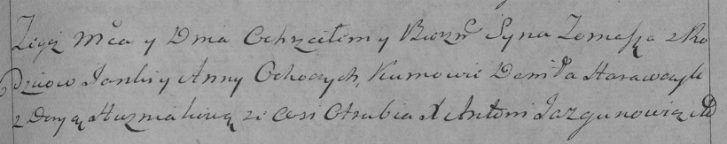

**Анна (Anna)**

19 октября 1794 г -- крещение сына Хомы (НИАБ 136-13-894, лист 23,
№49/1794-р (ориг)), (РГИА 823-2-18, лист 251, №35/1794-р (коп)).

**НИАБ 136-13-894:** Лист 23. **Метрическая запись №49/1794-р (ориг).**

{width="6.496527777777778in"
height="1.09627624671916in"}

Дедиловичская Покровская церковь. 19 октября 1794 года. Метрическая
запись о крещении.

Tomasz -- незаконнорожденный сын родителей с деревни Отруб.

Janka -- отец.

Anna -- мать.

Harauczyk Daniła - кум.

Huzniakowa Daryia - кума.

Jazgunowicz Antoni -- ксёндз.

**РГИА 823-2-18:** Лист 251. **Метрическая запись №35/1794-р (коп).**

{width="6.496527777777778in"
height="1.2916666666666667in"}

Дедиловичская Покровская церковь. 22 октября 1794 года. Метрическая
запись о крещении.

Ochoczy? Tomasz -- сын родителей с деревни Отруб.

Ochoczy? Janka -- отец.

Ochoczowa? Anna -- мать.

Harawczyk Daniła -- кум.

Huzniakowa Darya -- кума.

Jazgunowicz Antoni -- ксёндз.
