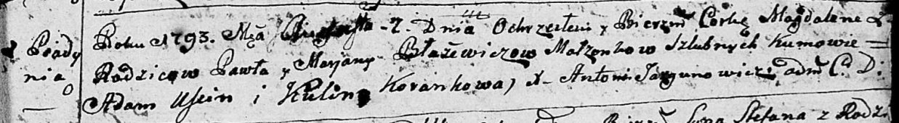

**Блажевич Марьяна (Błażewiczowa Marjana)**

7 августа 1793 г -- крещение дочери Магдалены (НИАБ 136-13-894, лист 20,
№59/1793-р (ориг)).

**НИАБ 136-13-894:** Лист 20. **Метрическая запись №59/1793-р (ориг).**

Дедиловичская Покровская церковь. 7 августа 1793 года. Метрическая
запись о крещении.

Błażewiczowna Magdalena -- дочь родителей с деревни Пядaнь.

Błażewicz Paweł -- отец.

Błażewiczowa Marjana -- мать.

Uscin Adam - кум.

Korańkowa Kulina - кума.

Jazgunowicz Antoni -- ксёндз родителей с деревни.
