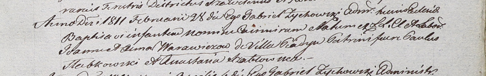

**Варавич Адам (Warawicz Adam)**

28 февраля 1811 г -- крещение сына Казимира (НИАБ 937-4-32, лист 23,
№4/1811-р).

**НИАБ 937-4-32:** Лист 23. **Метрическая запись №4/1811-р.**

Дедиловичский костел Наисвятейшего Сердца Иисуса. 28 февраля 1811 года.
Метрическая запись о крещении.

Warawicz Casimir -- сын крестьян с деревни Пядань.

Warawicz Adam -- отец.

Warawiczowa Anna -- мать.

Słabkowski Paul -- крестный отец.

Szabłowska Anastasia -- крестная мать.

Zychowski Gabriel -- ксёндз.
