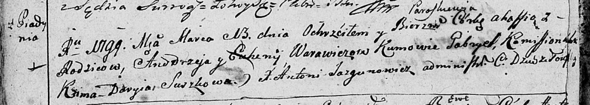
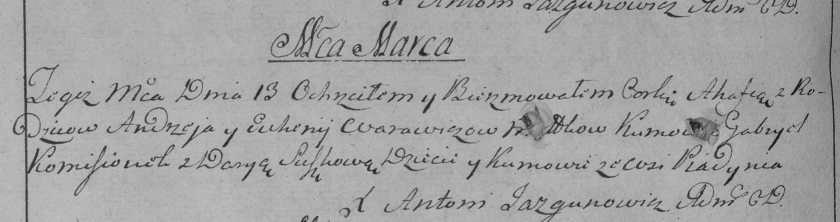
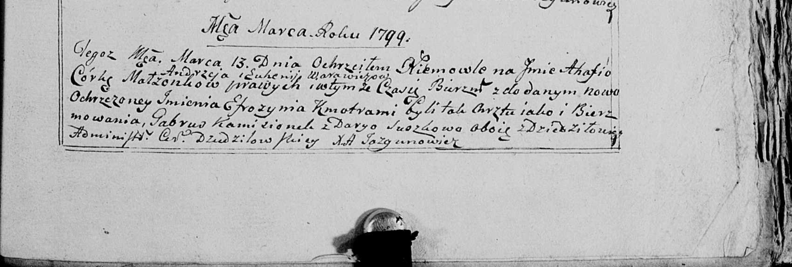

**Варавич Евгения (Warawiczowa Euhenija)**

13 марта 1799 г -- крещение дочери Агафии Параскевии (НИАБ 136-13-894,
лист 38об, №15/1799-р (ориг)), (РГИА 823-2-18, лист 268об, №15/1799-р
(коп), НИАБ 136-13-938, лист 241, №15/1799-р (коп)).

**НИАБ 136-13-894:** Лист 38об. **Метрическая запись №15/1799-р
(ориг).**

Дедиловичская Покровская церковь. 13 марта 1799 года. Метрическая запись
о крещении.

Warawiczowna Ahafia Paraskiewia -- дочь родителей с деревни Пядaнь.

Warawicz Andrzey -- отец.

Warawiczowa Euhenija -- мать.

Kamisionek Gabriel-- кум.

Suszkowa Daryia -- кума.

Jazgunowicz Antoni -- ксёндз.

**РГИА 823-2-18:** Лист 268об. **Метрическая запись №15/1799-р (коп).**

Дедиловичская Покровская церковь. 13 марта 1799 года. Метрическая запись
о крещении.

Warawiczowna Ahafia -- дочь родителей с деревни Пядань.

Warawicz Andrzey -- отец.

Warawicz Euhenija -- мать.

Komisionek Gabriel -- кум, с деревни Пядань.

Suszkowa Darya -- кума, с деревни Пядань.

Jazgunowicz Antoni -- ксёндз.

**НИАБ 136-13-938:** Лист 241. **Метрическая запись №15/1799-р (коп).**

(См. тж. НИАБ 136-13-894, лист 38об, №15/1799-р (ориг); РГИА 823-2-18,
лист 268об, №15/1799-р (коп))

Дедиловичская Покровская церковь. 13 марта 1799 года. Метрическая запись
о крещении.

Warawiczowna Ahafia Efrozynia -- дочь родителей с деревни \[Пядань\].

Warawicz Andrzey -- отец.

Warawiczowa Euhenija -- мать.

Kamisionek Gabruś -- кум, с деревни Дедиловичи.

Suszkowa Darya - кума, с деревни Дедиловичи.

Jazgunowicz Antoni -- ксёндз.
