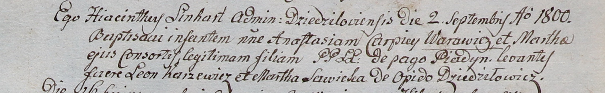

**Варавич Анастасия Карпеева (Warawiczowna Anastasia)**

2 сентября 1800 г -- крещение (НИАБ 937-4-32, лист 3, №28/1800-р).

**НИАБ 937-4-32:** Лист 3. **Метрическая запись №28/1800-р.**

{width="6.496527777777778in"
height="1.0027777777777778in"}

Дедиловичский костел Наисвятейшего Сердца Иисуса. 2 сентября 1800 года.
Метрическая запись о крещении.

Warawiczowna Anastasia -- дочь крестьян с деревни Пядань.

Warawicz Carpiey -- отец.

Warawiczowa Martha -- мать.

Karzewicz Leon -- крестный отец, с деревни Дедиловичи.

Sawicka Martha -- крестная мать, с деревни Дедиловичи.

Linhart Hyacinthus -- ксёндз.
