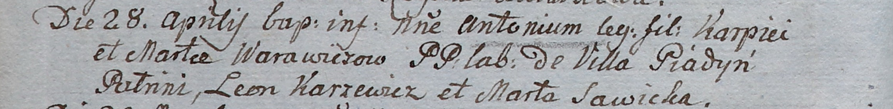

**Варавич Антон Карпеев (Warawicz Antoni)**

28 апреля 1805 г -- крещение (НИАБ 937-4-32, лист 11об, №20/1805-р).

**НИАБ 937-4-32:** Лист 11об. **Метрическая запись №20/1805-р.**

Дедиловичский костел Наисвятейшего Сердца Иисуса. 28 апреля 1805 года.
Метрическая запись о крещении.

Warawicz Antoni -- сын крестьян с деревни Пядань.

Warawicz Karpiey -- отец.

Warawiczowa Marta -- мать.

Karzewicz Leon -- крестный отец.

Sawicka Marta -- крестная мать.

Linhart Hiacinthus -- ксёндз.
