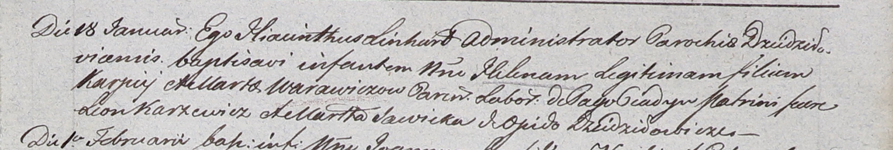

**Варавич Елена Карпеева (Warawiczowna Helena)**

18 января 1803 г -- крещение (НИАБ 937-4-32, лист 9, №1/1803-р).

**НИАБ 937-4-32:** Лист 9. **Метрическая запись №1/1803-р.**

Дедиловичский костел Наисвятейшего Сердца Иисуса. 18 января 1803 года.
Метрическая запись о крещении.

Warawiczowna Helena -- дочь крестьян с деревни Пядань.

Warawicz Karpiey -- отец.

Warawiczowa Marta -- мать.

Karzewicz Leon -- крестный отец.

Sawicka Marta -- крестная мать, с деревни Дедиловичи.

Linhart Hyacinthus -- ксёндз.
