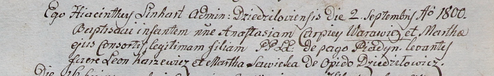
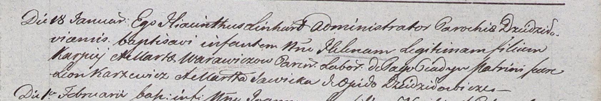
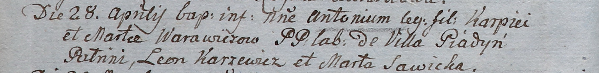
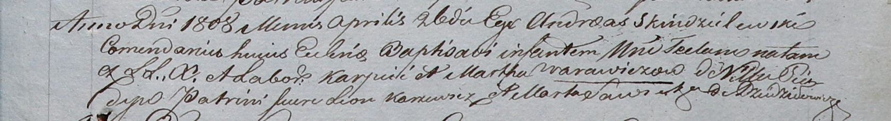

**Варавич Карпей (Warawicz Karpiey)**

2 сентября 1800 г -- крещение дочери Анастасии (НИАБ 937-4-32, лист 3,
№28/1800-р).

18 января 1803 г -- крещение дочери Елены (НИАБ 937-4-32, лист 9,
№1/1803-р).

28 апреля 1805 г -- крещение сына Антона (НИАБ 937-4-32, лист 11об,
№20/1805-р).

26 апреля 1808 г -- крещение дочери Текли (НИАБ 937-4-32, лист 18,
№13/1808-р).

**НИАБ 937-4-32:** Лист 3. **Метрическая запись №28/1800-р.**

Дедиловичский костел Наисвятейшего Сердца Иисуса. 2 сентября 1800 года.
Метрическая запись о крещении.

Warawiczowna Anastasia -- дочь крестьян с деревни Пядань.

Warawicz Carpiey -- отец.

Warawiczowa Martha -- мать.

Karzewicz Leon -- крестный отец, с деревни Дедиловичи.

Sawicka Martha -- крестная мать, с деревни Дедиловичи.

Linhart Hyacinthus -- ксёндз.

**НИАБ 937-4-32:** Лист 9. **Метрическая запись №1/1803-р.**

Дедиловичский костел Наисвятейшего Сердца Иисуса. 18 января 1803 года.
Метрическая запись о крещении.

Warawiczowna Helena -- дочь крестьян с деревни Пядань.

Warawicz Karpiey -- отец.

Warawiczowa Marta -- мать.

Karzewicz Leon -- крестный отец.

Sawicka Marta -- крестная мать, с деревни Дедиловичи.

Linhart Hyacinthus -- ксёндз.

**НИАБ 937-4-32:** Лист 11об. **Метрическая запись №20/1805-р.**

Дедиловичский костел Наисвятейшего Сердца Иисуса. 28 апреля 1805 года.
Метрическая запись о крещении.

Warawicz Antoni -- сын крестьян с деревни Пядань.

Warawicz Karpiey -- отец.

Warawiczowa Marta -- мать.

Karzewicz Leon -- крестный отец.

Sawicka Marta -- крестная мать.

Linhart Hiacinthus -- ксёндз.

**НИАБ 937-4-32:** Лист 18. **Метрическая запись №13/1808-р.**

Дедиловичский костел Наисвятейшего Сердца Иисуса. 26 апреля 1808 года.
Метрическая запись о крещении.

Warawiczowna Tecla -- дочь крестьян с деревни Пядань.

Warawicz Karp -- отец.

Warawiczowa Martha -- мать.

Karzewicz Leon -- крестный отец.

Sawicka Marta -- крестная мать, с деревни Дедиловичи.

Scindzelewski Andreas -- ксёндз, комендант Дедиловичский.
