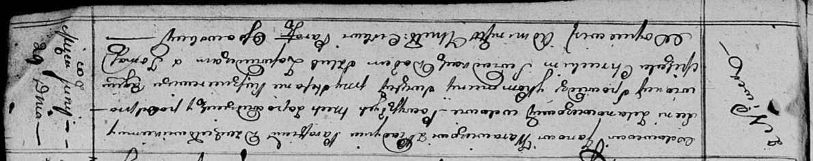

**Варавич Ян (Warawicz Jan)**

29 июня 1814 г -- венчание с вдовой Ксеней Зелянович с деревни Нивки
(НИАБ 136-13-920, лист 21, №7/1814-б (ориг)).

**НИАБ 136-13-920:** Лист 21. **Метрическая запись №7/1814-б (ориг).**

Осовская Покровская церковь. 29 июня 1814 года. Запись о венчании.

Warawicz Jan -- жених, вдовец, парафии католической Дедиловичской, с
деревни Пядань.

Zelanowiczowa Xienia -- невеста, вдова, с деревни Нивки.

Kusznierewicz Stefan -- свидетель.

Chrucki Michał -- свидетель.

Woyniewicz Tomasz -- ксёндз.
