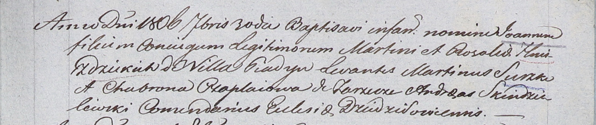

**Гнездицкий Иоанн Мартинов (Hniezdzicki Joann)**

30 сентября 1806 г -- крещение (НИАБ 937-4-32, лист 14, №20/1806-р).

**НИАБ 937-4-32:** Лист 14. **Метрическая запись №20/1806-р.**

{width="6.496527777777778in"
height="1.375in"}

Дедиловичский костел Наисвятейшего Сердца Иисуса. 30 сентября 1806 года.
Метрическая запись о крещении.

Hniezdzicki Joann -- сын родителей с деревни Пядань.

Hniezdzicki Martin -- отец.

Hniezdzicka Rosalia -- мать.

Suszko Martin -- крестный отец.

Czaplaiowa Chavrona -- крестная мать, с деревни Заречье.

Skindzelewski Andreas -- ксёндз, комендант Дедиловичский.
