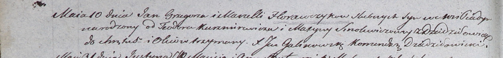

**Горавчик Ян Грегоров (Horawczyk Jan)**

10 мая 1803 г -- крещение (НИАБ 937-4-32, лист 9об, №13/1803-р).

**НИАБ 937-4-32:** Лист 9об. **Метрическая запись №13/1803-р.**

{width="6.496527777777778in"
height="0.7590277777777777in"}

Дедиловичский костел Наисвятейшего Сердца Иисуса. 10 мая 1803 года.
Метрическая запись о крещении.

Horawczyk Jan -- сын родителей с деревни Пядань.

Horawczyk Gregor -- отец.

Horawczykowa Marcella -- мать.

Kuszniarewicz Teodor -- крестный отец.

Smolewiczowa Maryna -- крестная мать, с деревни Дедиловичи.

Galinowski Joann -- ксёндз, комендант Дедиловичского костела.
