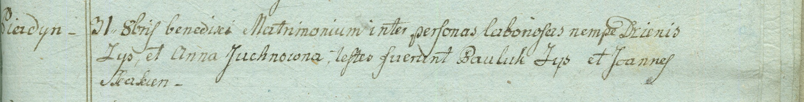

**Зыз (Юхно) Анна (Zysowa Anna z Juchnow)**

31 октября 1798 г -- венчание с Денисом Зызом с деревни Пядань (НИАБ
1781-27-199, лист 124, №4/1798-б).

**НИАБ 1781-27-199:** Лист 124. **Метрическая запись №4/1798-б.**

Дедиловичский костел Наисвятейшего Сердца Иисуса. 31 октября 1798 года.
Метрическая запись о венчании.

Zys Dzienis -- жених, крестьянин, с деревни Пядань.

Juchnowna Anna -- невеста, крестьянка.

Zys Pauluk -- свидетель.

Skakun Joann -- свидетель.

Linhart Hyacinthus -- ксёндз.
