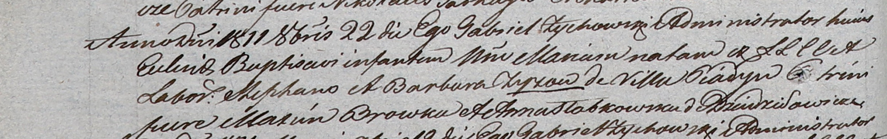

**Зыз Барбара (Zyzowa Barbara)**

25 августа 1801 г -- крещение сына Франциска (НИАБ 937-4-32, лист 4об,
№18/1800-р).

24 мая 1808 г -- крещение дочери Петронели (НИАБ 937-4-32, лист 18,
№14/1808-р).

22 октября 1811 г -- крещение дочери Марии (НИАБ 937-4-32, лист 23об,
№18/1811-р).

**НИАБ 837-4-32:** Лист 4об. **Метрическая запись №18/1801-р.**

{width="6.496527777777778in"
height="0.7263888888888889in"}

Дедиловичский костел Наисвятейшего Сердца Иисуса. 25 августа 1801 года.
Метрическая запись о крещении.

Zyz Francisc -- сын родителей с деревни Пядань.

Zyz Stefan -- отец.

Zyzowa Barbara -- мать.

Skakun Emilian -- крестный отец, с деревни Дедиловичи.

Makowska Anna -- крестная мать, с деревни Пядань.

Linhart Hyacinthus -- ксёндз.

**НИАБ 937-4-32:** Лист 18. **Метрическая запись №14/1808-р.**

{width="6.496527777777778in"
height="1.2805555555555554in"}

Дедиловичский костел Наисвятейшего Сердца Иисуса. 24 мая 1808 года.
Метрическая запись о крещении.

Zyzowna Petronilla -- дочь родителей с деревни Пядань.

Zyz Stephan -- отец.

Zyzowa Barbara -- мать.

Skakun Emilian -- крестный отец.

Słabkowska Anna -- крестная мать.

Scindzelewski Andreas -- ксёндз, комендант Дедиловичский.

**НИАБ 937-4-32:** Лист 23об. **Метрическая запись №18/1811-р.**

{width="6.496527777777778in"
height="1.0215277777777778in"}

Дедиловичский костел Наисвятейшего Сердца Иисуса. 22 октября 1811 года.
Метрическая запись о крещении.

Zyzowna Maria -- дочь крестьян с деревни Пядань.

Zyz Stephan -- отец.

Zyzowa Barbara -- мать.

Browka Maxim -- крестный отец.

Słabkowska Anna -- крестная мать, с деревни Дедиловичи.

Zychowski Gabriel -- ксёндз.
