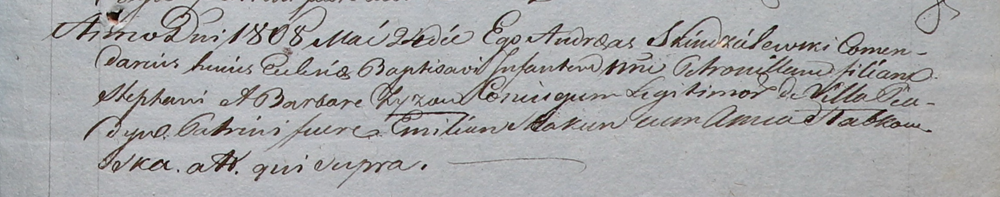

**Зыз Мария Стефанова (Zyzowna Maria)**

22 октября 1811 г -- крещение (НИАБ 937-4-32, лист 23об, №18/1811-р).

**НИАБ 937-4-32:** Лист 23об. **Метрическая запись №18/1811-р.**

{width="6.496527777777778in"
height="1.0215277777777778in"}

Дедиловичский костел Наисвятейшего Сердца Иисуса. 22 октября 1811 года.
Метрическая запись о крещении.

Zyzowna Maria -- дочь крестьян с деревни Пядань.

Zyz Stephan -- отец.

Zyzowa Barbara -- мать.

Browka Maxim -- крестный отец.

Słabkowska Anna -- крестная мать, с деревни Дедиловичи.

Zychowski Gabriel -- ксёндз.
