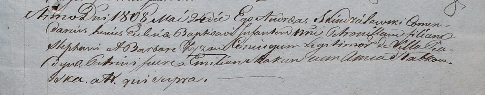

**Зыз Петронеля Стефанова (Zyzowna Petronilla)**

24 мая 1808 г -- крещение (НИАБ 937-4-32, лист 18, №14/1808-р).

**НИАБ 937-4-32:** Лист 18. **Метрическая запись №14/1808-р.**

Дедиловичский костел Наисвятейшего Сердца Иисуса. 24 мая 1808 года.
Метрическая запись о крещении.

Zyzowna Petronilla -- дочь родителей с деревни Пядань.

Zyz Stephan -- отец.

Zyzowa Barbara -- мать.

Skakun Emilian -- крестный отец.

Słabkowska Anna -- крестная мать.

Scindzelewski Andreas -- ксёндз, комендант Дедиловичский.
