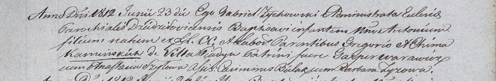

**Каминский Антон Грегоров (Kaminski Antoni)**

23 июня 1812 г -- крещение (НИАБ 937-4-32, лист 25, №16/1812-р).

**НИАБ 837-4-32:** Лист 25. **Метрическая запись №16/1812-р.**

Дедиловичский костел Наисвятейшего Сердца Иисуса. 23 июня 1812 года.
Метрическая запись о крещении.

Kaminski Antoni -- сын крестьян с деревни Пядань.

Kaminski Gregor -- отец.

Kaminska Chima -- мать.

Warawicz Gasper -- крестный отец.

Szyłowa Anastasia -- крестная мать.

Bielak Casimir - ассистент.

Zyzowa Barbara - ассистентка.

Zychowski Gabriel -- ксёндз.
