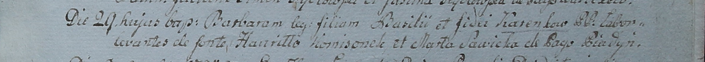

**Коренько Барбара Василева (Karańkowna Barbara)**

29 сентября 1799 г -- крещение (НИАБ 1781-27-199, лист 129, №43/1799-р).

**НИАБ 1781-27-199:** Лист 129. **Метрическая запись №43/1799-р.**

{width="6.496527777777778in"
height="0.5805555555555556in"}

Дедиловичский костел Наисвятейшего Сердца Иисуса. 29 сентября 1799 года.
Метрическая запись о крещении.

Karenkowna Barbara -- дочь крестьян с деревни Пядань.

Karenko Basili -- отец.

Karenkowa \[Wiera\] -- мать.

Komisonek Hauriłło -- крестный отец.

Sawicka Marta -- крестная мать.

Linhart Hyacinthus -- ксёндз.
