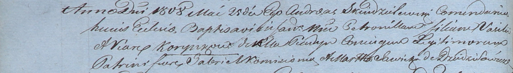

**Коренько Петронеля Василева (Korynkowna Petronilla)**

25 мая 1808 г -- крещение (НИАБ 937-4-32, лист 18об, №16/1808-р).

**НИАБ 937-4-32:** Лист 18об. **Метрическая запись №16/1808-р.**

Дедиловичский костел Наисвятейшего Сердца Иисуса. 25 мая 1808 года.
Метрическая запись о крещении.

Korynkowna Petronilla -- дочь родителей с деревни Пядань.

Korynko Vasil -- отец.

Korynkowa Viara -- мать.

Komisionek Gabriel -- крестный отец.

Sawicka Martha -- крестная мать, с деревни Дедиловичи.

Scindzelewski Andreas -- ксёндз, комендант Дедиловичский.
