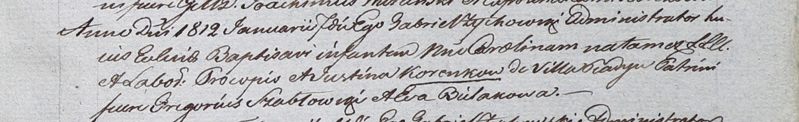

**Коренько Каролина Пракопова (Korenkowna Carolina)**

7 января 1812 г -- крещение (НИАБ 937-4-32, лист 24, №2/1812-р).

**НИАБ 937-4-32:** Лист 24. **Метрическая запись №2/1812-р.**

Дедиловичский костел Наисвятейшего Сердца Иисуса. 7 января 1812 года.
Метрическая запись о крещении.

Korenkowna Carolina -- дочь крестьян с деревни Пядань.

Korenko Procop -- отец.

Korenkowa Justina -- мать.

Szabłowski Gregorius -- крестный отец.

Bielakowa Eva -- крестная мать.

Zychowski Gabriel -- ксёндз.
