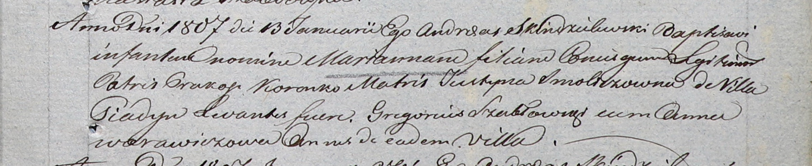

**Коренько Марьяна Пракопова (Korenkowna Marianna)**

13 января 1807 г -- крещение (НИАБ 937-4-32, лист 14, №1/1807-р).

**НИАБ 937-4-32:** Лист 14. **Метрическая запись №1/1807-р.**

Дедиловичский костел Наисвятейшего Сердца Иисуса. 13 января 1807 года.
Метрическая запись о крещении.

Korenkowna Marianna -- дочь родителей с деревни Пядань.

Korenko Prakop -- отец.

Korenkowa Justyna z Smoliczow -- мать.

Szabłowski Gregorius -- крестный отец, с деревни Пядань.

Warawiczowa Anna -- крестная мать, с деревни Пядань.

Skindzelewski Andreas -- ксёндз, викарий Дедиловичский.
