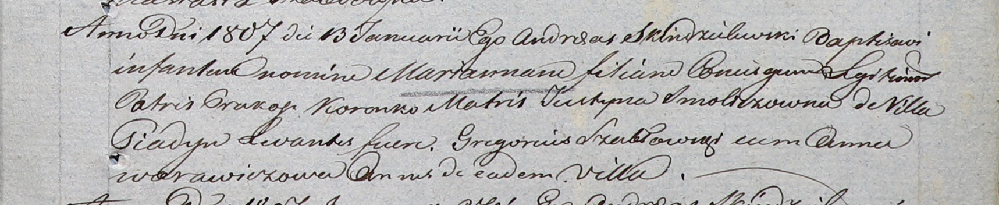
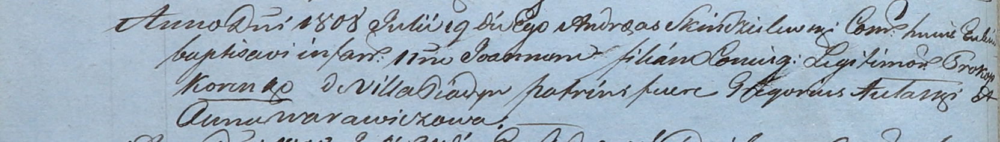
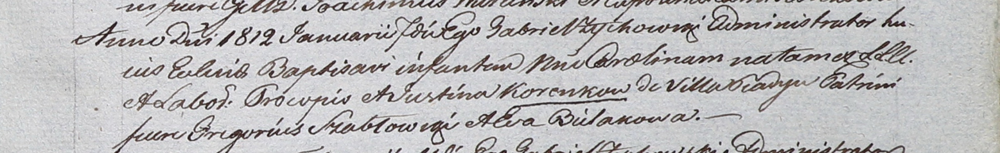

**Коренько (Смолич) Юстына (Korenkowa Justyna z Smoliczow)**

13 января 1807 г -- крещение дочери Марьяны (НИАБ 937-4-32, лист 14,
№1/1807-р).

19 июля 1808 г -- крещение сына Иоанна (НИАБ 937-4-32, лист 18об,
№20/1808-р).

7 января 1812 г -- крещение дочери Каролины (НИАБ 937-4-32, лист 24,
№2/1812-р).

**НИАБ 937-4-32:** Лист 14. **Метрическая запись №1/1807-р.**

Дедиловичский костел Наисвятейшего Сердца Иисуса. 13 января 1807 года.
Метрическая запись о крещении.

Korenkowna Marianna -- дочь родителей с деревни Пядань.

Korenko Prakop -- отец.

Korenkowa Justyna z Smoliczow -- мать.

Szabłowski Gregorius -- крестный отец, с деревни Пядань.

Warawiczowa Anna -- крестная мать, с деревни Пядань.

Skindzelewski Andreas -- ксёндз, викарий Дедиловичский.

**НИАБ 937-4-32:** Лист 18об. **Метрическая запись №20/1808-р.**

Дедиловичский костел Наисвятейшего Сердца Иисуса. 19 июля 1808 года.
Метрическая запись о крещении.

Korenko Joann -- сын родителей с деревни Пядань.

Korenko Prokop -- отец.

\[Korenko Justyna -- мать.\]

Aułasko Gregorius -- крестный отец.

Warawiczowa Anna -- крестная мать.

Scindzelewski Andreas -- ксёндз, комендант Дедиловичский.

**НИАБ 937-4-32:** Лист 24. **Метрическая запись №2/1812-р.**

Дедиловичский костел Наисвятейшего Сердца Иисуса. 7 января 1812 года.
Метрическая запись о крещении.

Korenkowna Carolina -- дочь крестьян с деревни Пядань.

Korenko Procop -- отец.

Korenkowa Justina -- мать.

Szabłowski Gregorius -- крестный отец.

Bielakowa Eva -- крестная мать.

Zychowski Gabriel -- ксёндз.
