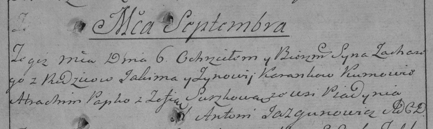

**Коренько Яким (Karańko Jakim)**

6 сентября 1786 г -- крещение сына Захарыя (РГИА 823-2-18, лист 232,
№22/1786-р (коп)).

**РГИА 823-2-18:** Лист 232. **Метрическая запись №22/1786-р (коп).**

Дедиловичская Покровская церковь. 6 сентября 1786 года. Метрическая
запись о крещении.

Karanko Zachary -- сын родителей с деревни Пядань.

Karanko Jakim -- отец.

Karankowa Zynowija -- мать.

Papko Atrachim -- кум.

Suszkowa Zofia - кума.

Jazgunowicz Antoni -- ксёндз.
