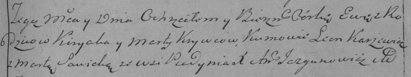

**Кривец Ева Кирыкова (Krywcowna Ewa)**

18 ноября 1795 г -- крещение дочери Евы (НИАБ 136-13-894, лист 26об,
№56/1795-р (ориг)), (РГИА 823-2-18, лист 254, №42/1795-р (коп)).

**НИАБ 136-13-894:** Лист 26об. **Метрическая запись №56/1795-р
(ориг).**

{width="6.496527777777778in"
height="1.1351662292213474in"}

Дедиловичская Покровская церковь. 18 ноября 1795 года. Метрическая
запись о крещении.

Krywcowna Ewa -- дочь родителей с деревни Пядaнь.

Krywec Kiryk -- отец.

Krywcowa Marta -- мать.

Karżewicz Leon - кум.

Sawicka Marta - кума.

Jazgunowicz Antoni -- ксёндз.

**РГИА 823-2-18:** Лист 254. **Метрическая запись №42/1795-р (коп).**

{width="6.496527777777778in"
height="1.2270833333333333in"}

Дедиловичская Покровская церковь. 18 ноября 1795 года. Метрическая
запись о крещении.

Krywcowna Ewa -- дочь родителей с деревни Пядань.

Krywiec Kiryak -- отец.

Krywcowa Marta -- мать.

Karżewicz Leon -- кум.

Sawicka Marta -- кума.

Jazgunowicz Antoni -- ксёндз.
