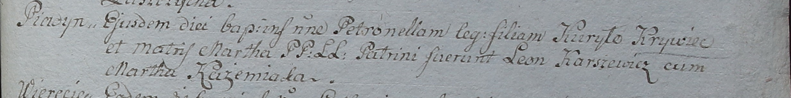

**Кривец Курыло (Krywiec Kuryło)**

13 мая 1798 г -- крещение дочери Петронели (НИАБ 1781-27-199, лист 122,
№4/1798-р).

16 сентября 1799 г -- отпевание, умер в возрасте 30 лет (родился около
1769 г) (НИАБ 1781-27-199, лист 131, №14/1799-у).

**НИАБ 1781-27-199:** Лист 122. **Метрическая запись №4/1798-р.**

Дедиловичский костел Наисвятейшего Сердца Иисуса. 13 мая 1798 года.
Метрическая запись о крещении.

Krywcowna Petronella -- дочь крестьян с деревни Пядань.

Krywiec Kuryło -- отец.

Krywcowa Martha -- мать.

Karszewicz Leon -- крестный отец.

Kazemiaka Martha - крестная мать.

Linhart Hyacinthus -- ксёндз.

**НИАБ 1781-27-199:** Лист 131. **Метрическая запись №14/1799-у.**

Дедиловичский костел Наисвятейшего Сердца Иисуса. 16 сентября 1799 года.
Метрическая запись об отпевании.

Krywiec Kuriłło -- умерший, 30 лет, с деревни Пядань.

Linhart Hyacinthus -- ксёндз.
