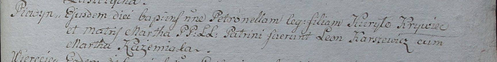

**Кривец Петронеля Курылова (Krywcowna Petronella)**

13 мая 1798 г -- крещение (НИАБ 1781-27-199, лист 122, №4/1798-р).

**НИАБ 1781-27-199:** Лист 122. **Метрическая запись №4/1798-р.**

Дедиловичский костел Наисвятейшего Сердца Иисуса. 13 мая 1798 года.
Метрическая запись о крещении.

Krywcowna Petronella -- дочь крестьян с деревни Пядань.

Krywiec Kuryło -- отец.

Krywcowa Martha -- мать.

Karszewicz Leon -- крестный отец.

Kazemiaka Martha - крестная мать.

Linhart Hyacinthus -- ксёндз.
