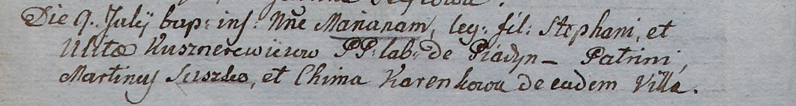

**Кушнеревич Стефан (Kusznierewicz Stephan)**

9 июля 1805 г -- крещение дочери Марьяны (НИАБ 937-4-32, лист 11об,
№24/1805-р).

**НИАБ 937-4-32:** Лист 11об. **Метрическая запись №24/1805-р.**

{width="6.496527777777778in"
height="0.8736111111111111in"}

Дедиловичский костел Наисвятейшего Сердца Иисуса. 9 июля 1805 года.
Метрическая запись о крещении.

Kusznierewiczowna Mariana -- дочь крестьян с деревни Пядань.

Kusznierewicz Stephan -- отец.

Kusznierewiczowa Ulita -- мать.

Suszko Martin -- крестный отец.

Karenkowa Chima -- крестная мать, с деревни Пядань.

Linhart Hiacinthus -- ксёндз.
