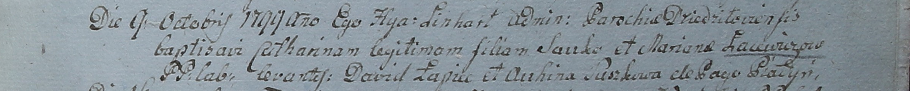

**Лаевич Марьяна (Łaiewiczowa Mariana)**

9 октября 1799 г -- крещение дочери Катарины (НИАБ 1781-27-199, лист
129, №44/1799-р).

**НИАБ 1781-27-199:** Лист 129. **Метрическая запись №44/1799-р.**

Дедиловичский костел Наисвятейшего Сердца Иисуса. 9 октября 1799 года.
Метрическая запись о крещении.

Łaiewiczowna Catharina -- дочь крестьян с деревни Пядань.

Łaiewicz Sauka -- отец.

Łaiewiczowa Mariana -- мать.

Łapiec Dawid -- крестный отец.

Suszkowa Auchina -- крестная мать.

Linhart Hyacinthus -- ксёндз.
