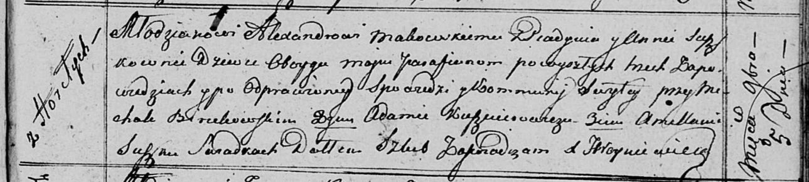

**Маковский Александр (Makowski Alexander)**

5 ноября 1816 г -- венчание с девкой Анной Сушко с деревни Горелое (НИАБ
136-13-920, лист 23, №7/1816-б (ориг)).

**НИАБ 136-13-920:** Лист 23. **Метрическая запись №7/1816-б (ориг).**

Осовская Покровская церковь. 5 ноября 1816 года. Запись о венчании.

Makowski Alexander -- жених, молодой, парафии Осовской, с деревни
Пядынь.

Suszkowna Anna -- невеста, девка, парафии Осовской, с деревни Горелое.

Birukowski Michał -- свидетель.

Kusznierowicz Adam -- свидетель.

Suszko Amillan -- свидетель.

Woyniewicz Tomasz -- ксёндз.
