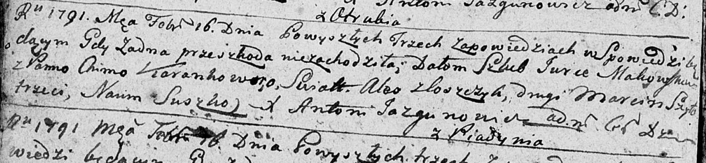
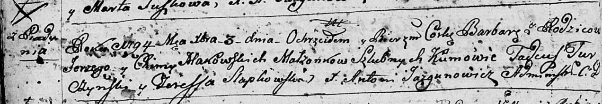
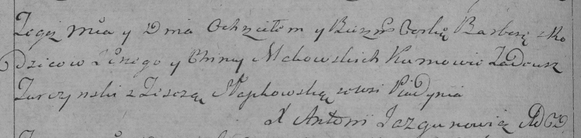

**Маковская (Коренько) Хима (Makowska Chima z Koreńkow)**

16 февраля 1791 г -- венчание с Юркой Маковским с деревни Пядань (НИАБ
136-13-894, лист 69об, №10/1791-б (ориг)).

31 августа 1792 г -- крещение сына Александра (НИАБ 136-13-894, лист
11об, №54/1792-р (ориг)), (РГИА 823-2-18, лист 245, №24/1792-р (коп)).

3 декабря 1794 г -- крещение дочери Варвары (НИАБ 136-13-894, лист 23об,
№60/1794-р (ориг)), (РГИА 823-2-18, лист 251об, №42/1794-р (коп)).

10 ноября 1798 г -- крещение сына Михала (НИАБ 136-13-894, лист 37об,
№56/1798-р (ориг)), (РГИА 823-2-18, лист 267, №57/1798-р (коп)).

20 октября 1801 г -- крещение сына Винцентия (НИАБ 937-4-32, лист 4об,
№21/1801-р).

14 июня 1804 г -- крещение сына Степана Игнацыя (НИАБ 136-13-894, лист
53об, №16/1804-р (ориг)).

**НИАБ 136-13-894:** Лист 69об. **Метрическая запись №10/1791-б
(ориг).**

Дедиловичская Покровская церковь. 16 февраля 1791 года. Метрическая
запись о венчании.

Makowski Jurka -- жених, с деревни Пядaнь.

Karańkowna Chima -- невеста.

Zloszczyk Aleś -- свидетель.

Szyło Marcin -- свидетель.

Suszko Naum -- свидетель.

Jazgunowicz Antoni -- ксёндз.

**НИАБ 136-13-894:** Лист 16об. **Метрическая запись №54/1792-р
(ориг).**

Дедиловичская Покровская церковь. 31 августа 1792 года. Метрическая
запись о крещении.

Makowski Alexander -- сын родителей с деревни Пядaнь.

Makowski Jerzy -- отец.

Makowska Chima -- мать.

Szyło Stanislaw - кум.

Słabkowska Teresa - кума.

Żukowski A. -- ксёндз, администратор Мстижской церкви.

**РГИА 823-2-18:** Лист 245. **Метрическая запись №24/1792-р (коп).**

Дедиловичская Покровская церковь. 31 августа 1792 года. Метрическая
запись о крещении.

Makowski Alexander -- сын родителей с деревни Пядань.

Makowski Jerzy -- отец.

Makowska Chima -- мать.

Szyło Stanisław -- кум.

Słabkowska Teresa -- кума.

Jazgunowicz Antoni -- ксёндз.

**НИАБ 136-13-894:** Лист 23об. **Метрическая запись №60/1794-р
(ориг).**

Дедиловичская Покровская церковь. 3 декабря 1794 года. Метрическая
запись о крещении.

Makowska Barbara -- дочь родителей с деревни Пядaнь.

Makowski Jerzy -- отец.

Makowska Chima -- мать.

Turczynski Tadeusz - кум.

Słapkowska Teresa - кума.

Jazgunowicz Antoni -- ксёндз.

**РГИА 823-2-18:** Лист 251об. **Метрическая запись №42/1794-р (коп).**

Дедиловичская Покровская церковь. 3 декабря 1794 года. Метрическая
запись о крещении.

Makowska Barbara -- дочь родителей с деревни Пядань.

Makowski Jerzy -- отец.

Makowska Chima -- мать.

Turczynski Tadeusz -- кум.

Słapkowska Teresa -- кума.

Jazgunowicz Antoni -- ксёндз.

**НИАБ 136-13-894:** Лист 37об. **Метрическая запись №56/1798-р
(ориг).**

Дедиловичская Покровская церковь. 10 ноября 1798 года. Метрическая
запись о крещении.

Makowski Michał -- сын родителей с деревни Пядaнь.

Makowski Jurka -- отец.

Makowska Chima -- мать.

Szyło Stanisław - кум.

Słabkowska Teresa - кума.

Jazgunowicz Antoni -- ксёндз.

**РГИА 823-2-18:** Лист 267. **Метрическая запись №57/1798-р (коп).**

Дедиловичская Покровская церковь. 10 ноября 1798 года. Метрическая
запись о крещении.

Makowski Michał -- сын родителей с деревни Пядань.

Makowski Jurka -- отец.

Makowska Chima -- мать.

Szyło Stanisław -- кум.

Słabkowska Teresia -- кума.

Jazgunowicz Antoni -- ксёндз.

**НИАБ 937-4-32:** Лист 4об. **Метрическая запись №21/1801-р.**

Дедиловичский костел Наисвятейшего Сердца Иисуса. 20 октября 1801 года.
Метрическая запись о крещении.

Makowski Vincentium -- сын вольных людей с деревни Пядань.

Makowski Georgi -- отец.

Makowska Chimka z Korenżankow -- мать.

Szydłowski Stanisław -- крестный отец, с деревни Шилы.

Słabkowska Teresia -- крестная мать, с деревни Дедиловичи.

Linhart Hyacinthus -- ксёндз.

**НИАБ 136-13-894:** Лист 53об. **Метрическая запись №16/1804-р
(ориг).**

Дедиловичская Покровская церковь. 14 июня 1804 года. Метрическая запись
о крещении.

Makowski Stefan Jgnacy -- сын родителей с деревни Пядaнь.

Makowski Jerzy -- отец.

Makowska Chima -- мать.

Jurkiewicz Tadeusz -- кум.

Słabkowska Teressa -- кума.

Jazgunowicz Antoni -- ксёндз.
