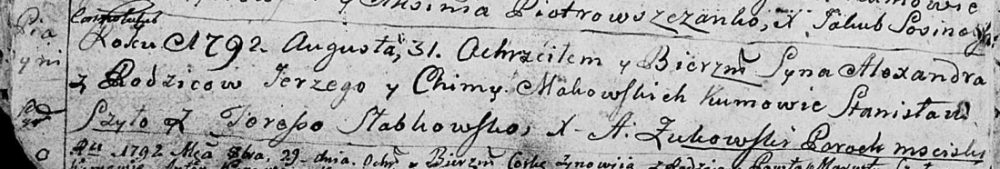
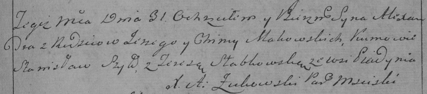

**Маковский Александр Юрков (Makowski Alexander)**

31 августа 1792 г -- крещение (НИАБ 136-13-894, лист 11об, №54/1792-р
(ориг)), (РГИА 823-2-18, лист 245, №24/1792-р (коп)).

**НИАБ 136-13-894:** Лист 16об. **Метрическая запись №54/1792-р
(ориг).**

Дедиловичская Покровская церковь. 31 августа 1792 года. Метрическая
запись о крещении.

Makowski Alexander -- сын родителей с деревни Пядaнь.

Makowski Jerzy -- отец.

Makowska Chima -- мать.

Szyło Stanislaw - кум.

Słabkowska Teresa - кума.

Żukowski A. -- ксёндз, администратор Мстижской церкви.

**РГИА 823-2-18:** Лист 245. **Метрическая запись №24/1792-р (коп).**

Дедиловичская Покровская церковь. 31 августа 1792 года. Метрическая
запись о крещении.

Makowski Alexander -- сын родителей с деревни Пядань.

Makowski Jerzy -- отец.

Makowska Chima -- мать.

Szyło Stanisław -- кум.

Słabkowska Teresa -- кума.

Jazgunowicz Antoni -- ксёндз.
