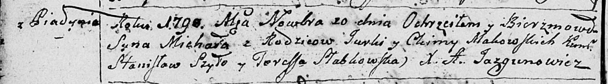

**Маковский Винцентий Юрков (Makowski Vincenti)**

20 октября 1801 г -- крещение (НИАБ 937-4-32, лист 4об, №21/1801-р).

**НИАБ 937-4-32:** Лист 4об. **Метрическая запись №21/1801-р.**

{width="6.496527777777778in"
height="0.7291666666666666in"}

Дедиловичский костел Наисвятейшего Сердца Иисуса. 20 октября 1801 года.
Метрическая запись о крещении.

Makowski Vincentium -- сын вольных людей с деревни Пядань.

Makowski Georgi -- отец.

Makowska Chimka z Korenżankow -- мать.

Szydłowski Stanisław -- крестный отец, с деревни Шилы.

Słabkowska Teresia -- крестная мать, с деревни Дедиловичи.

Linhart Hyacinthus -- ксёндз.
