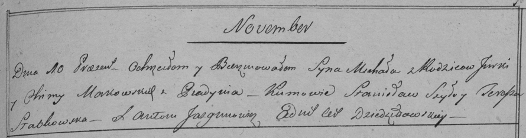

**Маковский Михал Юрков (Makowski Michał)**

10 ноября 1798 г -- крещение (НИАБ 136-13-894, лист 37об, №56/1798-р
(ориг)), (РГИА 823-2-18, лист 267, №57/1798-р (коп)).

**НИАБ 136-13-894:** Лист 37об. **Метрическая запись №56/1798-р
(ориг).**

{width="6.496527777777778in"
height="0.9058530183727034in"}

Дедиловичская Покровская церковь. 10 ноября 1798 года. Метрическая
запись о крещении.

Makowski Michał -- сын родителей с деревни Пядaнь.

Makowski Jurka -- отец.

Makowska Chima -- мать.

Szyło Stanisław - кум.

Słabkowska Teresa - кума.

Jazgunowicz Antoni -- ксёндз.

**РГИА 823-2-18:** Лист 267. **Метрическая запись №57/1798-р (коп).**

{width="6.496527777777778in"
height="1.7083333333333333in"}

Дедиловичская Покровская церковь. 10 ноября 1798 года. Метрическая
запись о крещении.

Makowski Michał -- сын родителей с деревни Пядань.

Makowski Jurka -- отец.

Makowska Chima -- мать.

Szyło Stanisław -- кум.

Słabkowska Teresia -- кума.

Jazgunowicz Antoni -- ксёндз.
