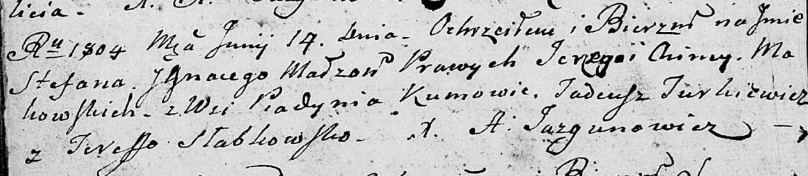

**Маковский Степан Юрков (Makowski Stefan Jgnacy)**

14 июня 1804 г -- крещение (НИАБ 136-13-894, лист 53об, №16/1804-р
(ориг)).

**НИАБ 136-13-894:** Лист 53об. **Метрическая запись №16/1804-р
(ориг).**

Дедиловичская Покровская церковь. 14 июня 1804 года. Метрическая запись
о крещении.

Makowski Stefan Jgnacy -- сын родителей с деревни Пядaнь.

Makowski Jerzy -- отец.

Makowska Chima -- мать.

Jurkiewicz Tadeusz -- кум.

Słabkowska Teressa -- кума.

Jazgunowicz Antoni -- ксёндз.
