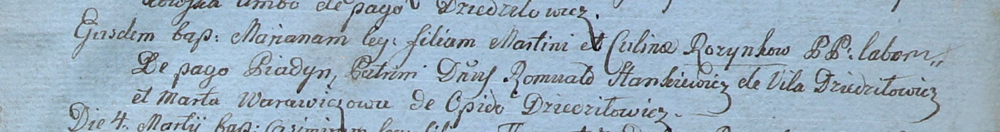

**Розынко Марьяна Мартинова (Rozynkowna Mariana)**

29 января 1800 г -- крещение (НИАБ 937-4-32, лист 1, №3/1800-р).

**НИАБ 937-4-32:** Лист 1. **Метрическая запись №3/1800-р.**

Дедиловичский костел Наисвятейшего Сердца Иисуса. 29 января 1800 года.
Метрическая запись о крещении.

Rozynkowna Mariana -- дочь крестьян с деревни Пядань.

Rozynko Martin -- отец.

Rozynkowa Culina -- мать.

Stankiewicz Romuald -- крестный отец, шляхтич, с деревни Дедиловичи.

Warawiczowa Marta -- крестная мать, с деревни Дедиловичи.

Linhart Hyacinthus -- ксёндз.
