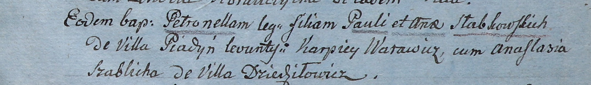

**Слабковский Павел (Słabkowski Paul)**

5 февраля 1805 г -- крещение дочери Петронели (НИАБ 937-4-32, лист 11,
№7/1805-р).

**НИАБ 937-4-32:** Лист 11. **Метрическая запись №7/1805-р.**

Дедиловичский костел Наисвятейшего Сердца Иисуса. 5 февраля 1805 года.
Метрическая запись о крещении.

Słabkowska Petronella -- дочь родителей с деревни Пядань.

Słabkowski Paul -- отец.

Słabkowska Anna -- мать.

Warawicz Karpiey -- крестный отец.

Szablicha Anastasia -- крестная мать, с деревни Дедиловичи.

Linhart Hiacinthus -- ксёндз.
