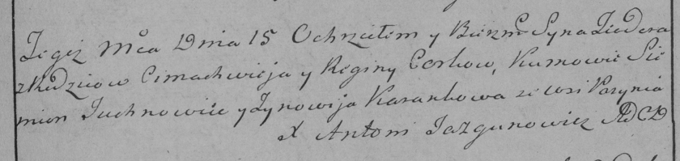

**Чурка Тодор Цимахвеев (Cerko Teodor)**

15 февраля 1786 г -- крещение (РГИА 823-2-18, лист 231, №6/1786-р
(коп)).

**РГИА 823-2-18:** Лист 231. **Метрическая запись №6/1786-р (коп).**

{width="6.496527777777778in"
height="1.538888888888889in"}

Дедиловичская Покровская церковь. 15 февраля 1786 года. Метрическая
запись о крещении.

Cerko Teodor -- сын родителей с деревни Пядань.

Cerko Cimachwiey -- отец.

Cerkowa Regina -- мать.

Juchnowiec Siemion -- кум.

Karankowa Zynowija - кума.

Jazgunowicz Antoni -- ксёндз.
