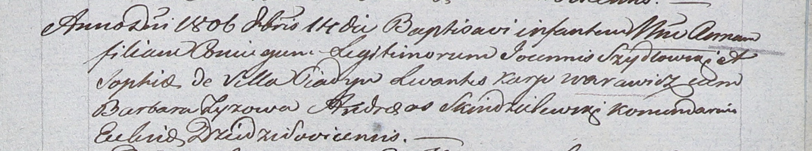

**Шидловский Иоанн (Szydłowski Joann)**

14 октября 1806 г -- крещение дочери Анны (НИАБ 937-4-32, лист 14,
№21/1806-р).

**НИАБ 937-4-32:** Лист 14. **Метрическая запись №21/1806-р.**

Дедиловичский костел Наисвятейшего Сердца Иисуса. 14 октября 1806 года.
Метрическая запись о крещении.

Szydłowska Anna -- дочь родителей с деревни Пядань.

Szydłowski Joann -- отец.

Szydłowska Sophia -- мать.

Warawicz Karp -- крестный отец.

Zyzowa Barbara -- крестная мать.

Skindzelewski Andreas -- ксёндз, комендант Дедиловичский.
