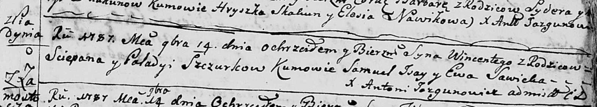

**Шчурка Винценты Степанов (Szczurka Wincenty)**

14 ноября 1787 г -- крещение (НИАБ 136-13-894, лист 3, №60/1787-р
(ориг)).

**НИАБ 136-13-894:** Лист 3. **Метрическая запись №60/1787-р (ориг).**

{width="6.496527777777778in"
height="1.1707020997375328in"}

Дедиловичская Покровская церковь. 14 ноября 1787 года. Метрическая
запись о крещении.

Szczurka Wincenty -- сын родителей с деревни Пядань.

Szczurka Sciepan -- отец.

Szczurkowa Paladya -- мать.

Jsay Samuel - кум.

Sawicka Ewa - кума.

Jazgunowicz Antoni -- ксёндз.
