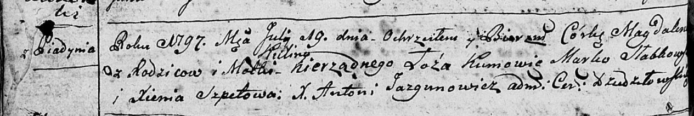

**Кулина (Kulina)**

19 июля 1797 г -- крещение дочери Магдалены (НИАБ 136-13-894, лист 33об,
№45/1797-р (ориг)).

**НИАБ 136-13-894:** Лист 33об. **Метрическая запись №45/1797-р
(ориг).**

{width="6.496527777777778in"
height="1.0889009186351706in"}

Дедиловичская Покровская церковь. 19 июля 1797 года. Метрическая запись
о крещении.

Magdalena -- незаконнорожденная дочь матери с деревни Пядaнь.

Kulina -- мать.

Słabkowski Marko - кум.

Szpetowa Xienia - кума.

Jazgunowicz Antoni -- ксёндз.
