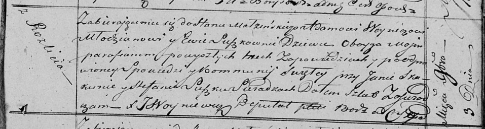

**Войнич Адам (Woynicz Adam)**

3 ноября 1818 г -- венчание с девкой Евой Сушко (НИАБ 136-13-920, лист
25, №5/1818-б (ориг)).

**НИАБ 136-13-894:** Лист 25. **Метрическая запись №5/1818-б (ориг).**

Осовская Покровская церковь. 3 ноября 1818 года. Запись о венчании.

Woynicz Adam -- жених, молодой, парафии Осовской, с деревни Разлитье.

Suszkowna Ewa -- невеста, девка, парафии Осовской.

Skakun Jan -- свидетель.

Suszko Stefan -- свидетель.

Woyniewicz Tomasz -- ксёндз.
