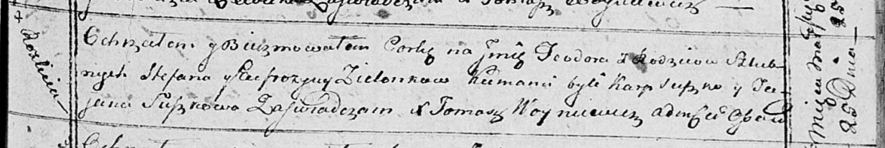

**Зелёнка Ефрозына (Zielonkowa Eufrozyna)**

25 марта 1815 г -- крещение дочери Тодоры (НИАБ 136-13-894, лист 92,
№18/1815-р (ориг)).

**НИАБ 136-13-894:** Лист 92. **Метрическая запись №18/1815-р (ориг).**

Осовская Покровская церковь. 25 марта 1815 года. Метрическая запись о
крещении.

Zielonkowna Teodora -- дочь родителей с деревни Разлитье.

Zielonko Stefan -- отец.

Zielonkowa Eufrozyna -- мать.

Suszko Karp -- кум.

Suszkowa Taciana -- кума.

Woyniewicz Tomasz -- ксёндз.
