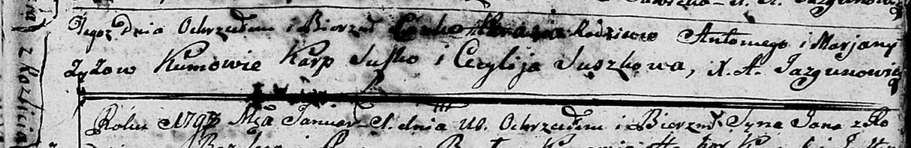
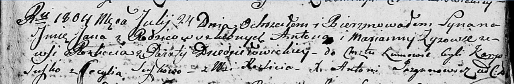
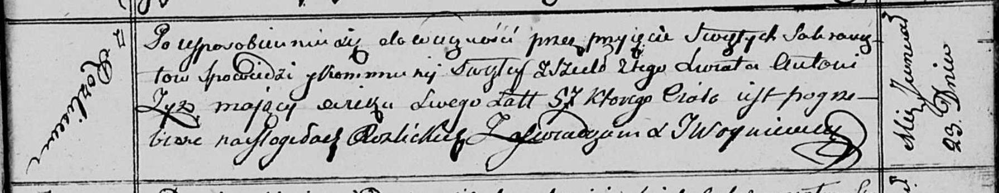

**Зыз Антон (Zyz Antoni)**

27 декабря 1797 г -- крещение дочери Параси (НИАБ 136-13-894, лист 35,
№70/1797-р (ориг)), (РГИА 823-2-18, лист 261об, №51/1797-р (коп)).

24 июля 1804 г -- крещение сына Яна (НИАБ 136-13-894, лист 54,
№23/1804-р (ориг)).

23 января 1813 г -- отпевание, умер в возрасте 57 лет (родился около
1756 г) (НИАБ 136-13-919, лист 25, №3/1813-у (ориг)).

**НИАБ 136-13-894:** Лист 35. **Метрическая запись №70/1797-р (ориг).**

Дедиловичская Покровская церковь. 27 декабря 1797 года. Метрическая
запись о крещении.

Zyzowa Parasia -- дочь родителей с деревни Разлитье.

Zyz Antoni -- отец.

Zyzowa Marjana -- мать.

Suszko Karp - кум.

Suszkowa Cecylija - кума.

Jazgunowicz Antoni -- ксёндз.

**РГИА 823-2-18:** Лист 261об. **Метрическая запись №51/1797-р (коп).**

Дедиловичская Покровская церковь. 27 декабря 1797 года. Метрическая
запись о крещении.

Zyzowna Parasia -- дочь родителей с деревни Разлитье.

Zyz Antoni -- отец.

Zyzowa Marjanna -- мать.

Suszko Karp -- кум.

Suszkowa Cecylia -- кума.

Jazgunowicz Antoni -- ксёндз.

**НИАБ 136-13-894:** Лист 54. **Метрическая запись №23/1804-р (ориг).**

Дедиловичская Покровская церковь. 24 июля 1804 года. Метрическая запись
о крещении.

Zyz Jan -- сын родителей с деревни Разлитье.

Zyz Anton -- отец.

Zyzowa Marjanna -- мать.

Suszko Karp -- кум.

Suszkowa Cecylia -- кума, с деревни Разлитье.

Jazgunowicz Antoni -- ксёндз.

**НИАБ 136-13-919:** Лист 25. **Метрическая запись №3/1813-у (ориг).**

Осовская униатская церковь. 23 января 1813 года. Метрическая запись об
отпевании.

Zyz Antoni -- умерший, 57 лет, с деревни Разлитье, похоронен на кладбище
деревни Разлитье.

Woyniewicz Tomasz -- ксёндз.
