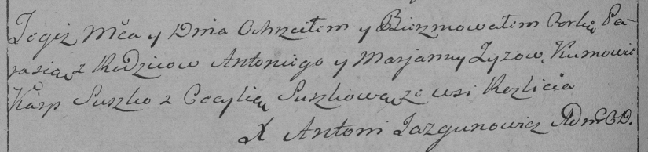

**Зыз Парася Антонова (Zyzowna Parasia)**

27 декабря 1797 г -- крещение (НИАБ 136-13-894, лист 35, №70/1797-р
(ориг)), (РГИА 823-2-18, лист 261об, №51/1797-р (коп)).

**НИАБ 136-13-894:** Лист 35. **Метрическая запись №70/1797-р (ориг).**

{width="6.496527777777778in"
height="1.0600688976377952in"}

Дедиловичская Покровская церковь. 27 декабря 1797 года. Метрическая
запись о крещении.

Zyzowa Parasia -- дочь родителей с деревни Разлитье.

Zyz Antoni -- отец.

Zyzowa Marjana -- мать.

Suszko Karp - кум.

Suszkowa Cecylija - кума.

Jazgunowicz Antoni -- ксёндз.

**РГИА 823-2-18:** Лист 261об. **Метрическая запись №51/1797-р (коп).**

{width="6.496527777777778in"
height="1.5277777777777777in"}

Дедиловичская Покровская церковь. 27 декабря 1797 года. Метрическая
запись о крещении.

Zyzowna Parasia -- дочь родителей с деревни Разлитье.

Zyz Antoni -- отец.

Zyzowa Marjanna -- мать.

Suszko Karp -- кум.

Suszkowa Cecylia -- кума.

Jazgunowicz Antoni -- ксёндз.
