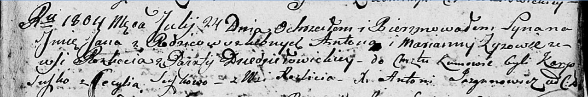

**Зыз Ян Антонов (Zyz Jan)**

24 июля 1804 г -- крещение (НИАБ 136-13-894, лист 54, №23/1804-р
(ориг)).

**НИАБ 136-13-894:** Лист 54. **Метрическая запись №23/1804-р (ориг).**

{width="6.496527777777778in"
height="1.0734787839020123in"}

Дедиловичская Покровская церковь. 24 июля 1804 года. Метрическая запись
о крещении.

Zyz Jan -- сын родителей с деревни Разлитье.

Zyz Anton -- отец.

Zyzowa Marjanna -- мать.

Suszko Karp -- кум.

Suszkowa Cecylia -- кума, с деревни Разлитье.

Jazgunowicz Antoni -- ксёндз.
