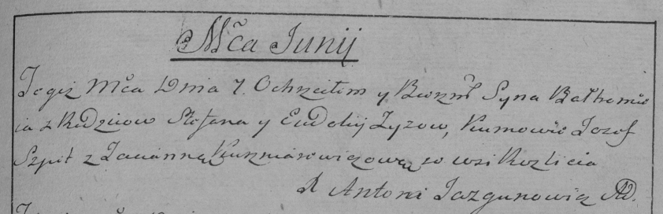

**Зыз Балтромей (Zyz Bałtromiey)**

7 июня 1797 г -- крещение (НИАБ 136-13-894, лист 33об, №37/1797-р
(ориг)), (РГИА 823-2-18, лист 260, №25/1797-р (коп)).

**НИАБ 136-13-894:** Лист 33об. **Метрическая запись №37/1797-р
(ориг).**

{width="6.496527777777778in"
height="0.8079593175853018in"}

Дедиловичская Покровская церковь. 7 июня 1797 года. Метрическая запись о
крещении.

Zyz Bałtromey -- сын родителей с деревни Разлитье.

Zyz Stefan -- отец.

Zyzowa Ewdokija -- мать.

Szpet Jozef - кум.

Kusznierowiczowa Taciana - кума.

Jazgunowicz Antoni -- ксёндз.

**РГИА 823-2-18:** Лист 260. **Метрическая запись №25/1797-р (коп).**

{width="6.496527777777778in"
height="2.098611111111111in"}

Дедиловичская Покровская церковь. 7 июня 1797 года. Метрическая запись о
крещении.

Zyz Bałtromiej -- сын родителей с деревни Разлитье.

Zyz Stefan -- отец.

Zyzowa Eudokija -- мать.

Szpet Jozef -- кум.

Kuszniarewiczowa Tacianna -- кума.

Jazgunowicz Antoni -- ксёндз.
