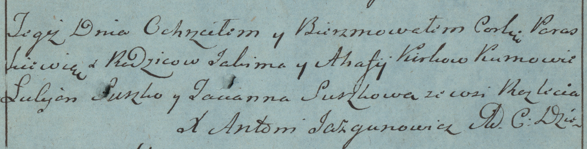

**Керко Агафия (Kirkowa Ahafija)**

20 августа 1782 г -- крещение дочери Параскевии (РГИА 823-2-18, лист
222, №3/1782-р (коп)).

**РГИА 823-2-18:** Лист 222. **Метрическая запись №3/1782-р (коп).**

{width="6.496527777777778in"
height="1.6583333333333334in"}

Дедиловичская униатская церковь. 20 августа 1782 года. Метрическая
запись о крещении.

Kirkowna Paraskiewia -- дочь родителей с деревни Разлитье.

Kirko Jakim -- отец.

Kirkowa Ahafia -- мать.

Suszko Łukjan -- кум.

Suszkowa Tacianna - кума.

Jazgunowicz Antoni -- ксёндз.
