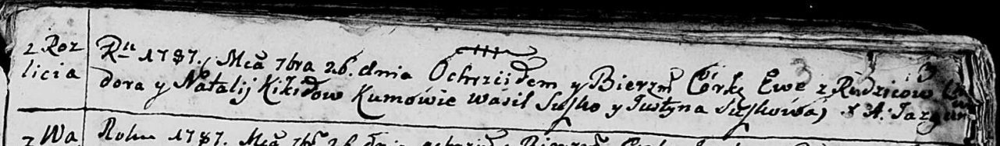
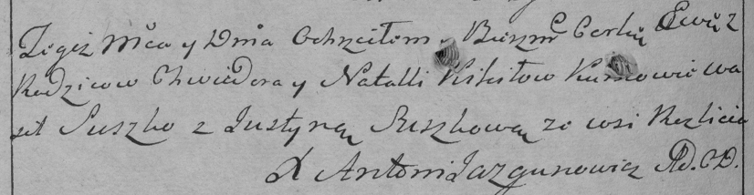

**Кикило Хведор (Kikiło Chwiedor)**

26 сентября 1787 -- крещение дочери Евы (НИАБ 136-13-894, лист 3,
№50/1787-р (ориг)), (РГИА 823-2-18, лист 234об, №27/1787-р (коп)).

**НИАБ 136-13-894:** Лист 3. **Метрическая запись №50/1787-р (ориг).**

Дедиловичская Покровская церковь. 26 сентября 1787 года. Метрическая
запись о крещении.

Kikiłowna Ewa -- дочь родителей с деревни Разлитье.

Kikiło Chwiedor -- отец.

Kikiłowa Natalija -- мать.

Suszko Wasil - кум.

Suszkowa Justyna - кума.

Jazgunowicz Antoni -- ксёндз.

**РГИА 823-2-18:** Лист 234об. **Метрическая запись №27/1787-р (коп).**

Дедиловичская Покровская церковь. 26 сентября 1787 года. Метрическая
запись о крещении.

Kikiłowna Ewa -- дочь родителей с деревни Разлитье.

Kikiło Chwiedor -- отец.

Kikiłowa Natalla -- мать.

Suszko Wasil -- кум.

Suszkowa Justyna - кума.

Jazgunowicz Antoni -- ксёндз.
