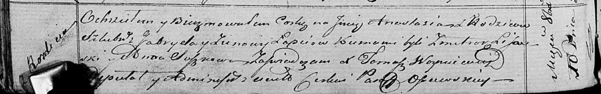

**Лапец Габриэль (Łapieć Gabriel)**

10 октября 1820 г -- крещение дочери Анастасии (НИАБ 136-13-894, лист
104об, №33/1820-р (ориг)).

**НИАБ 136-13-894:** Лист 104об. **Метрическая запись №33/1820-р
(ориг).**

{width="6.496527777777778in"
height="1.0245319335083114in"}

Осовская Покровская церковь. 10 октября 1820 года. Метрическая запись о
крещении.

Łapciowna Anastazija -- дочь родителей с деревни Разлитье.

Łapiec Gabriel -- отец.

Łapciowa Zienowia -- мать.

Lisowski Zmitrok -- кум.

Suszkowa Anna -- кума.

Woyniewicz Tomasz -- ксёндз.
