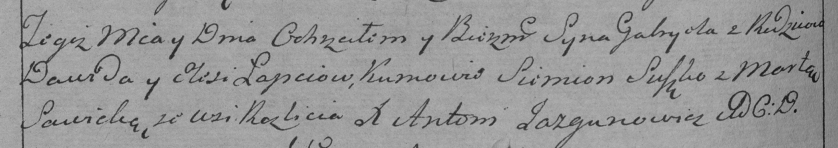

**Лапец Василь Давидов (Łapiec Wasil)**

15 марта 1787 г -- крещение (РГИА 823-2-18, лист 228об, №8/1785-р
(коп)).

**РГИА 823-2-18:** Лист 228об. **Метрическая запись №8/1785-р (коп).**

{width="6.496527777777778in"
height="2.5368055555555555in"}

Дедиловичская Покровская церковь. 15 марта 1785 года. Метрическая запись
о крещении.

Łapiec Wasil -- сын родителей с деревни Разлитье.

Łapiec Dawid -- отец.

Łapciewa Elesia -- мать.

Suszko Siemion -- кум.

Suszkowa Marta - кума.

Nestorowicz Antoni -- ксёндз.
