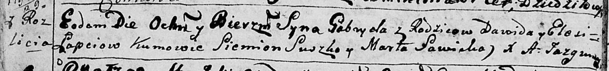

**Лапец Габриэль Давидов (Łapać Gabriel)**

25 июля 1792 г -- крещение (НИАБ 136-13-894, лист 16об, №43/1782-р
(ориг)), (РГИА 823-2-18, лист 244, №20/1792-р (коп)).

**НИАБ 136-13-894:** Лист 16об. **Метрическая запись №43/1792-р
(ориг).**

Дедиловичская Покровская церковь. 25 июля 1792 года. Метрическая запись
о крещении.

Łapać Gabryel -- сын родителей с деревни Разлитье.

Łapać Dawid -- отец.

Łapciowa Elesia -- мать.

Suszko Siemion - кум.

Sawicka Marta - кума.

Jazgunowicz Antoni -- ксёндз.

**РГИА 823-2-18:** Лист 244об. **Метрическая запись №20/1792-р (коп).**

Дедиловичская Покровская церковь. 25 июля 1792 года. Метрическая запись
о крещении.

Łapiec Gabriel -- сын родителей с деревни Разлитье.

Łapiec Dawid -- отец.

Łapciowa Elesia -- мать.

Suszko Siemion -- кум.

Sawicka Marta -- кума.

Jazgunowicz Antoni -- ксёндз.
